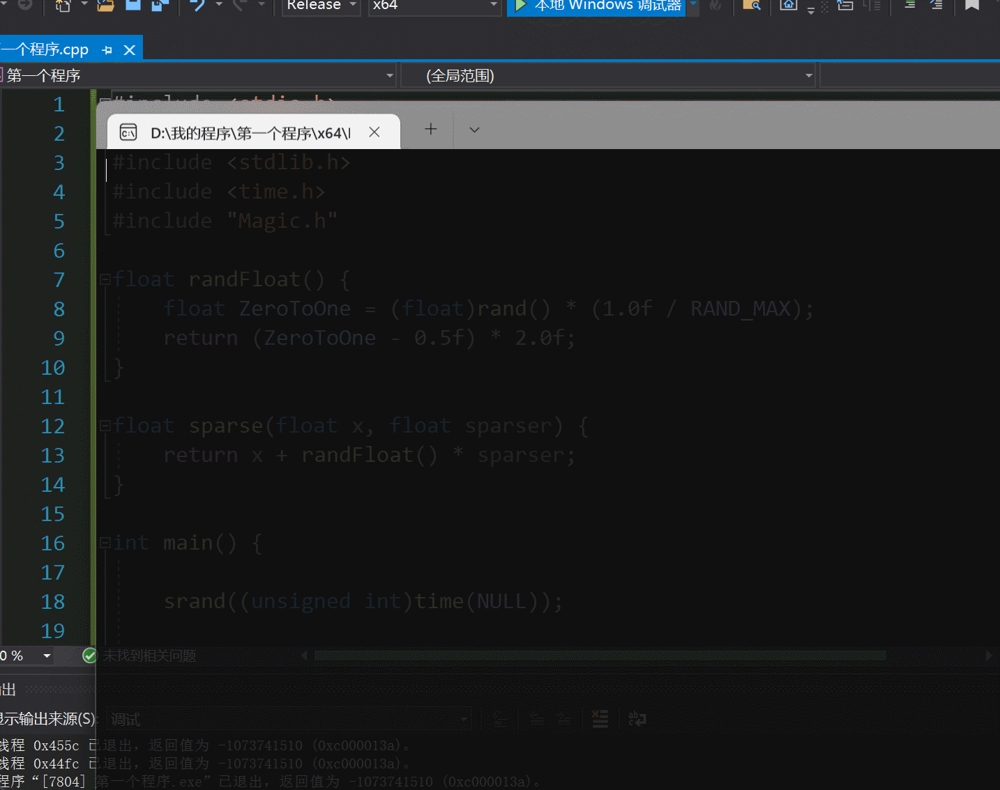

# MagicSaibao 魔法赛宝

一款简单蹦床游戏的Demo示例程序，用于帮助新手熟悉Magic.h图形框架的开发方式。

目前实现了如下特性：

- 蹦床效果：带有重力加速度，有真实感的物理计算
- 鼠标侦测：踏板跟随鼠标移动
- 状态判断：当赛宝触碰到边缘，游戏结束

## Demo 效果演示

点击如下图片或 [此链接](README.assets/MagicSaibao_Demo_v1.0.0.mp4)，即可播放Demo视频：

[](README.assets/MagicSaibao_Demo_v1.0.0.mp4)

或者直接播放视频（部分情况不支持）：

<video src="README.assets/MagicSaibao_Demo_v1.0.0.mp4"></video>
## License 开源声明

### 程序主体：完全开源

本软件由 @SirJackie 开发，依据 Mulan PSL v2 进行开源，授予您永久性的、全球性的、免费的、非独占的、不可撤销的版权许可。您可以复制、使用、修改、分发该软件，不论修改与否。

协议内容详见本目录下“LICENSE”文件。

### 图形素材：完全开源

背景图和踏板图片素材，取自Scratch开源项目，十分感谢！

根据 [Scratch Project License](https://en.scratch-wiki.info/wiki/Scratch_Project_License)，Scratch项目使用 `Creative Commons Attribution Share-Alike License 2.0 (CC-BY-SA)` 协议进行开源，根据此许可，用户不能被阻止下载、重新混合或以其他方式访问程序的某些部分：

```
Under this license, a user cannot be prevented from downloading, remixing, or otherwise being able to access some part of the program. This is agreed to when the creator uploads their project to the Scratch website.
```

因此，背景图和踏板图片素材，属于公共领域素材，您可以任意使用。

### 主角人物素材：有限使用


本游戏所采用的主角素材 “赛宝”，其明确为福建师范大学计算机与网络空间安全学院所专属的吉祥物。任何单位或个人对于该素材的使用，均应遵循严格的规定与限制。

您仅可在有限的情形下使用该素材，当且仅当您已成功获得福建师范大学以及计算机与网络空间安全学院的明确书面授权；或者，您使用该素材的目的纯粹且仅局限于福建师范大学内部的交流活动，包括但不限于学校内部举办的学术研讨、教学活动、学生社团活动等，且该使用行为不得涉及任何形式的商业用途、对外传播或谋取经济利益。

若未经上述合法授权，或超出规定的使用范围而擅自使用 “赛宝” 素材，均将被视为严重违反法律规定的侵权行为。福建师范大学及计算机与网络空间安全学院将依法追究侵权者的法律责任，以维护自身合法权益。

